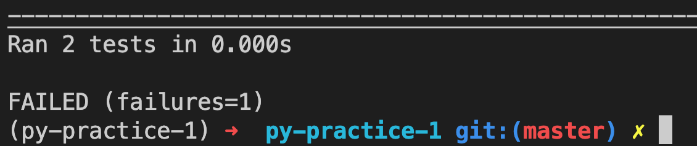
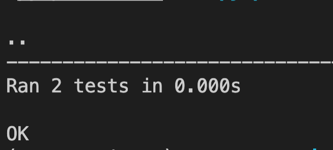

# Code Challenge - Python 1

- Over the next few weeks, we will be testing your knowledge on several code concepts to ensure that you understand them.
- These assessments are meant to give you coding practice and to ensure that you follow directions and understand them.
- We are here to help you get through them if needed.
- [Instructions](#instructions-to-use)
- [Submit your Challenge](#to-submit-your-challenge)

## Instructions to use

1. Navigate to the directory that you will clone the repo

    ```terminal
    cd workspace/python/exercises
    ```

1. Clone this repo to your local and move into it

    ```terminal
    git clone [LINK_TO_THIS_REPO]
    cd {YOUR-REPO-NAME}
    ```

1. Create a new branch

    ```terminal
    git checkout -b YOUR-BRANCH-NAME
    ```

1. Download dependencies

    ```terminal
    pipenv shell
    pipenv install
    pre-commit install
    ```

1. Start Coding - Open the `contents/main.py` file and add your code in the file.

## To Test Your Changes

After you make the changes to the challenges, you can run a test to see if your answers are correct. You can run this as many times as needed until all the tests pass.

```terminal
python -m unittest content/test_main.py
```

### Failing tests will have red in the final output



### All passing tests will be green. This means you are completed with this exercise



## To Submit Your Challenge

1. After you have made all the code changes and run the tests locally and they all pass, add, commit and push the branch up to GitHub
1. Create a PR against the main branch
1. Check to make sure the tests are passing in github by looking either on the Checks tab of the pull request, or right above the Merge Pull Request button.
1. If they do pass, merge the PR into master and copy the link to the repo to submit the Assignments card in Google Classroom.

## Don't Forget

HAVE FUN!
